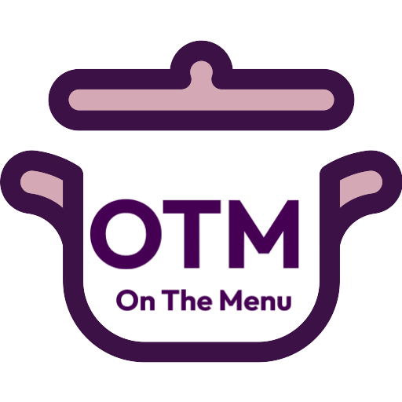
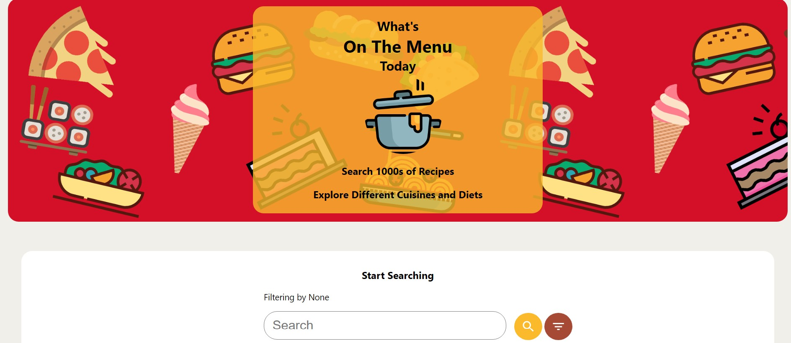
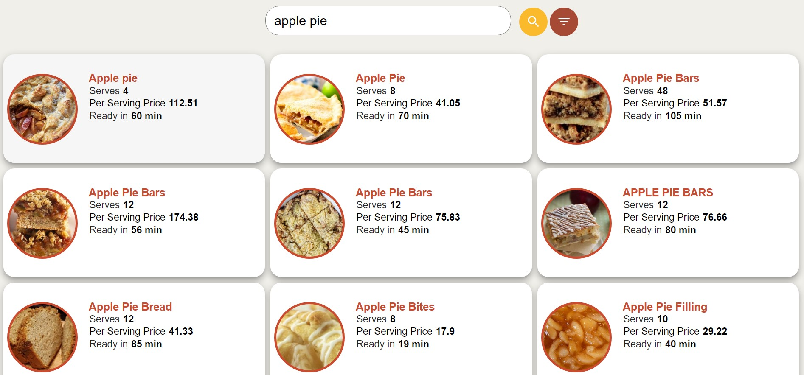
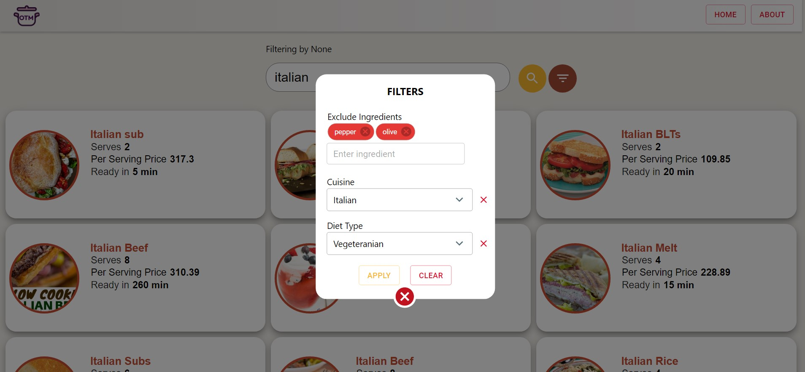
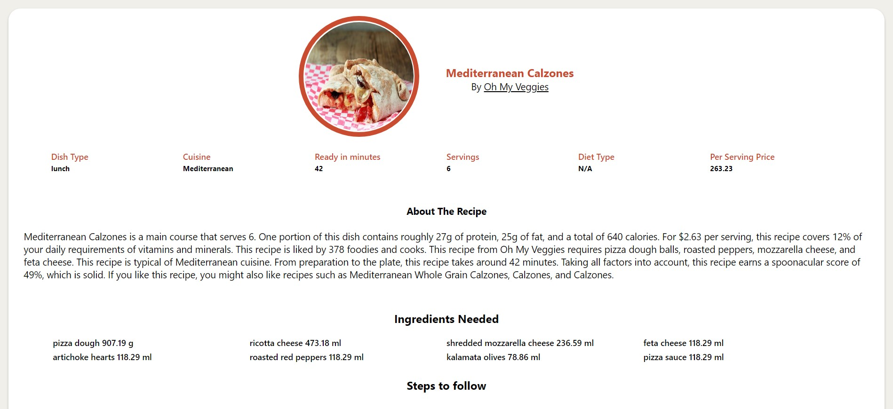

<h2>On The Menu (https://on-the-menu.vercel.app/) </h2> 

  </img>

On The Menu (OTM) is a responsive react web app that brings you 1000s of recipes all over the internet filtered according to ingredietns, cuisine or diets you want.
You can search for recipes and view step by step instruction to add something special to your menu at home. It uses Spoonacular API to enable the app to look for recipes.

**Take a dive into the app:**

<https://on-the-menu.vercel.app/>

**Some Screenshots**

   

   

   

Find the source code at: <https://github.com/jatinAroraGit/OnTheMenu>

Built Using React, TypeScript and CSS

Code and project is not available to copy, reproduce, share or modify in any form. Any mention or description of this website or source code must be attributed to Jatin Arora
